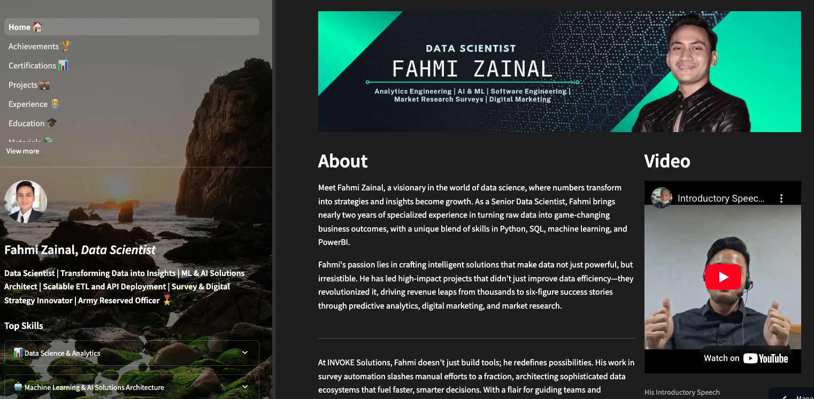

# **📊 Fahmi Zainal Portfolio Website 📊**

<!-- Badge to Visit My Portfolio -->
<div align="center"> 
    <a href="https://fahmizainal-portfolio.streamlit.app/">
        
    </a>
</div>

<div align="center">
    <!-- Image as a link -->
    <a href="https://img.shields.io/badge/Visit%20My%20Portfolio-Streamlit%20App-brightgreen?style=for-the-badge&logo=streamlit">
        
    </a>
</div>

<div style="text-align: center;">
    <h1>Personal Portfolio built with Streamlit</h1>
    
</div>
<br>

---

## **📋 Overview**
The **Fahmi Zainal Portfolio Website** is a personal web application designed to showcase my professional experience, achievements, certifications, projects, and educational background. Built using Streamlit, this website serves as an interactive platform to highlight my journey and expertise in data science, software development, and more.

---

## **Table of Contents**

1. [🎯 Objectives](#-objectives)
2. [🔧 Technologies Used](#-technologies-used)
3. [🗂️ Directory Structure](#-directory-structure)
4. [📁 Pages and Components](#-pages-and-components)
5. [📊 Visual Elements](#-visual-elements)
6. [🔄 Project Workflow](#-project-workflow)
7. [🎉 Conclusion](#-conclusion)
8. [🔮 Future Enhancements](#-future-enhancements)
9. [📚 References](#-references)
10. [📜 License](#-license)

---

## **🎯 Objectives**

- **🌍 Create an engaging and professional portfolio website** to showcase my skills, experience, and achievements.
- **📚 Organize content effectively** with a clear structure and user-friendly navigation.
- **💻 Develop interactive features** using Streamlit components to allow visitors to explore my work dynamically.
- **🔗 Provide downloadable resources** such as CV, project files, and additional materials.

---

## **🔧 Technologies Used**


---

## **🗂️ Directory Structure**

The project structure is as follows:

```plaintext
.
├── Dockerfile
├── License
├── README.md
├── app
│   ├── 1_Home_🏠.py
│   ├── component.py
│   ├── modules
│   │   ├── Achievements
│   │   ├── Certification
│   │   ├── Education
│   │   ├── Feedback_Discussion
│   │   ├── Introduction
│   │   ├── Jobs
│   │   ├── Materials
│   │   └── Projects
│   └── pages
│       ├── 2_Achievements_🏆.py
│       ├── 3_Certifications_📊.py
│       ├── 4_Projects_💼.py
│       ├── 5_Experience_💻.py
│       ├── 6_Education_🎓.py
│       ├── 7_Materials_📚.py
│       └── 8_Feedback_and_Discussion_💬.py
├── assets
│   ├── background_sidebar.jpg
│   ├── background_video_bird-ezgif.com-optimize.gif
│   └── tile.gif
├── photos
│   ├── Achievements
│   ├── Certifications
│   ├── Education_Logo
│   ├── Experience_Company_Logo
│   ├── My_Photo
│   └── Projects
└── requirements.txt
```

---

## **📁 Pages and Components**

- **🏠 Home:** Introduction and personal background.
- **🏆 Achievements:** Highlights of my professional and personal accomplishments.
- **📊 Certifications:** Details of certifications and courses completed.
- **💼 Projects:** Showcases my key projects with descriptions, images, and links to repositories.
- **💻 Experience:** A summary of my work experience and roles.
- **🎓 Education:** Educational background and academic achievements.
- **📚 Materials:** Resources and documents available for download.
- **💬 Feedback and Discussion:** A form for visitors to leave feedback or engage in discussions.

---

## **📊 Visual Elements**

This portfolio website incorporates various visual elements:
- **Backgrounds:** Custom images for the sidebar and backgrounds.
- **Photos and Logos:** Images related to achievements, certifications, education, experience, and projects.
- **Interactive GIFs:** Animated elements to make the website visually engaging.

---

## **🔄 Project Workflow**

1. **📂 Setting up the Environment:**
   - Initialize a virtual environment and install dependencies using `requirements.txt`.
   - Use Docker to containerize the application for easy deployment.

2. **🧩 Developing the Pages:**
   - Create individual Python scripts for each page using Streamlit components.
   - Integrate navigation and ensure smooth transitions between pages.

3. **🔍 Adding Content and Visuals:**
   - Populate each page with content, images, and interactive elements.
   - Optimize images and GIFs for performance.

4. **🚀 Deploying the Website:**
   - Deploy the website using Streamlit sharing or Docker for cloud deployment.
   - Set up CI/CD pipelines for automated updates and maintenance.

---

## **🎉 Conclusion**

This portfolio website serves as a comprehensive showcase of my professional journey, skills, and projects. It is designed to provide an interactive and engaging experience for visitors, allowing them to explore my work and connect with me easily.

---

## **🔮 Future Enhancements**

- **🌐 Multilingual Support:** Add support for multiple languages to reach a wider audience.
- **🔧 Enhanced Interactivity:** Implement more interactive elements, such as charts and filters for dynamic content viewing.
- **💾 Database Integration:** Store feedback and visitor data for further analysis and engagement.

---

## **📚 References**

- [Streamlit Documentation](https://docs.streamlit.io/)
- [Docker Documentation](https://docs.docker.com/)
- [Python Documentation](https://docs.python.org/3/)

---

## **📜 License**

**Fahmi Zainal Custom License**

All rights reserved. This project is the intellectual property of Fahmi Zainal. Unauthorized copying, use, or distribution of any code, content, or material from this project is strictly prohibited.

You may not:
- Copy, reproduce, or distribute any part of this code or project.
- Use the code or content for any purpose, commercial or otherwise, without prior written consent from Fahmi Zainal.
- Modify, decompile, or reverse-engineer any portion of this codebase.

By using or accessing any part of this project, you agree to be bound by the terms of this license.
